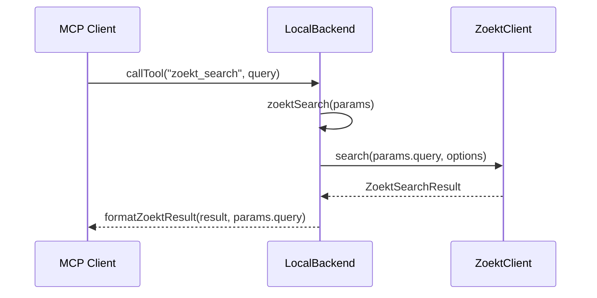

# Optimize Zoekt Search Query Param Implementation Plan

> **For agentic workers:** REQUIRED SUB-SKILL: Use superpowers:subagent-driven-development (recommended) or superpowers:executing-plans to implement this plan task-by-task. Steps use checkbox (`- [ ]`) syntax for tracking.

**Goal:** Remove the redundant `zoekt` input from the `zoekt_search` MCP tool and keep raw Zoekt syntax available through the existing `query` parameter.

**Architecture:** `zoekt_search` is declared in `gitnexus/src/mcp/tools.ts`, dispatched through `LocalBackend.callTool`, and executed by `LocalBackend.zoektSearch`. The change should keep one public query string field, update backend parameter handling to avoid `(params as any).zoekt`, and pin the contract with unit tests.

**Tech Stack:** TypeScript, MCP tool schema, Vitest, GitNexus local backend.

---

## Scope And Assumptions

- Jira ID: none provided.
- Current branch: `main`, allowed by repository rules.
- API-First: MCP tool input schema is the API contract. No HTTP route/VO/DTO is involved.
- DB-First: Not applicable. No database schema or SQL changes.
- Java single-entry test controller: Not applicable. Repository is TypeScript; `manage_ai_auto_test_controller.py` reported no Maven/Gradle project root.
- GitNexus impact: Required before source edits. Current registry is empty, so impact must be attempted again after `npx tsx gitnexus/src/cli/index.ts analyze` or another working GitNexus command is available. If unavailable, record the blocker and use `rg` as fallback evidence.

## Files

- Modify: `gitnexus/src/mcp/tools.ts`
  - Remove `zoekt_search.inputSchema.properties.zoekt`.
  - Move raw Zoekt query guidance into `query.description`.
  - Set `zoekt_search.inputSchema.required` to `['query']`.
- Modify: `gitnexus/src/mcp/local/local-backend.ts`
  - Change `zoektSearch` to read only `params.query`.
  - Remove `(params as any).zoekt` from the formatted original query.
- Modify: `gitnexus/test/unit/tools.test.ts`
  - Assert `zoekt_search` no longer exposes `zoekt`.
  - Assert `query` is required and documents raw Zoekt syntax.
- Optional test if existing coverage is insufficient: `gitnexus/test/unit/calltool-dispatch.test.ts`
  - Add/adjust a backend dispatch test proving `query` flows to `ZoektClient.search`.

---

### Task 1: Pre-Edit Impact And Contract Check

- [ ] **Step 1: Confirm source diff baseline**

Run:

```powershell
git status --short
git diff -- gitnexus/src/core/search/zoekt-client.ts gitnexus/src/mcp/tools.ts gitnexus/src/mcp/local/local-backend.ts gitnexus/test/unit/tools.test.ts
```

Expected:

- Existing user change in `gitnexus/src/core/search/zoekt-client.ts` remains visible.
- No leftover edits in `tools.ts`, `local-backend.ts`, or `tools.test.ts` before implementation starts.

- [ ] **Step 2: Attempt GitNexus impact for modified symbols**

Run:

```powershell
npx tsx gitnexus/src/cli/index.ts impact zoektSearch --direction upstream
npx tsx gitnexus/src/cli/index.ts impact GITNEXUS_TOOLS --direction upstream
```

Expected:

- If index is available, record direct callers/importers and risk level.
- If tool reports no indexed repositories or CLI resolver failure, record the exact error and use the fallback search in Step 3.

- [ ] **Step 3: Fallback reference search**

Run:

```powershell
rg -n "zoekt_search|zoektSearch|params as any\\)\\.zoekt|Overridden by \" gitnexus/src gitnexus/test
```

Expected:

- All public schema and backend usage points are identified before editing.

### Task 2: Write Failing Contract Test

- [ ] **Step 1: Update `tools.test.ts` first**

Add assertions inside `documents precise Zoekt filters and bounded context lines`:

```ts
expect(tool.inputSchema.required).toEqual(['query']);
expect(tool.inputSchema.properties).not.toHaveProperty('zoekt');
expect(tool.inputSchema.properties.query.description).toContain('Supports raw Zoekt syntax');
```

- [ ] **Step 2: Run the focused test and verify RED**

Run:

```powershell
cd gitnexus; npx vitest run test/unit/tools.test.ts
```

Expected:

- FAIL before implementation because `zoekt` is still present and `query` is not required.

### Task 3: Implement Minimal Schema And Backend Change

- [ ] **Step 1: Update `gitnexus/src/mcp/tools.ts`**

Change only the `zoekt_search` input schema:

```ts
query: {
  type: 'string',
  description:
    'Zoekt query string. Supports raw Zoekt syntax; for Chinese phrases, wrap the phrase in double quotes. Spaces mean AND. Use uppercase OR for alternatives.',
},
```

Remove:

```ts
zoekt: {
  type: 'string',
  description:
    'Advanced: Raw Zoekt query string. MANDATORY for Chinese phrases. RULES: 1. Wrap Chinese phrases in double quotes. 2. Spaces mean AND. 3. Use uppercase OR for alternatives.',
},
```

Set:

```ts
required: ['query'],
```

- [ ] **Step 2: Update `gitnexus/src/mcp/local/local-backend.ts`**

Change:

```ts
let q = (params as any).zoekt || params.query;
```

to:

```ts
let q = params.query;
```

Change:

```ts
return this.formatZoektResult(
  result,
  (params as any).zoekt || params.query || (params as any).symbol,
);
```

to:

```ts
return this.formatZoektResult(result, params.query);
```

### Task 4: Verification

- [ ] **Step 1: Run focused unit test**

Run:

```powershell
cd gitnexus; npx vitest run test/unit/tools.test.ts
```

Expected:

- PASS.

- [ ] **Step 2: Run TypeScript typecheck**

Run:

```powershell
cd gitnexus; npx tsc --noEmit
```

Expected:

- Exit code 0.

- [ ] **Step 3: Run targeted search for removed contract**

Run:

```powershell
rg -n "Overridden by \"zoekt\"|properties\\.zoekt|params as any\\)\\.zoekt" gitnexus/src gitnexus/test
```

Expected:

- No matches in `zoekt_search` implementation/schema.
- Any remaining `zoekt?: string` in the main `query` tool path is reviewed separately and not changed by this task.

### Task 5: Compliance Audit And Delivery

- [ ] **Step 1: Review diff**

Run:

```powershell
git diff --stat
git diff -- gitnexus/src/mcp/tools.ts gitnexus/src/mcp/local/local-backend.ts gitnexus/test/unit/tools.test.ts
```

Expected:

- Diff is limited to the schema, backend method, and focused test.

- [ ] **Step 2: Report function call relationship**

Report:

```text
MCP client -> LocalBackend.callTool('zoekt_search') -> LocalBackend.zoektSearch(params) -> ZoektClient.search(query, options) -> LocalBackend.formatZoektResult(result, query)
```

- [ ] **Step 3: Report Mermaid v8-compatible flow**



- [ ] **Step 4: Do not commit or push**

Repository rule: no `git commit` or `git push` unless the user explicitly asks.

---

## Self-Review

- Spec coverage: covers removing redundant `zoekt` parameter, backend cleanup, tests, validation, and delivery artifacts.
- Placeholder scan: no TBD/TODO placeholders.
- Type consistency: public input is `query`; backend reads `params.query`; tests assert `query`.
