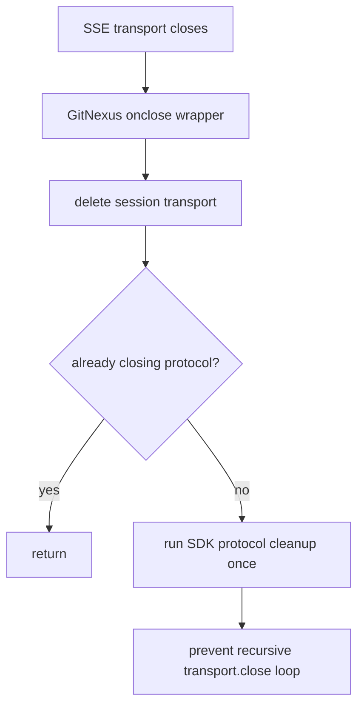

# MCP SSE Close Reentry Fix Implementation Plan

> **For agentic workers:** REQUIRED SUB-SKILL: Use superpowers:subagent-driven-development (recommended) or superpowers:executing-plans to implement this plan task-by-task. Steps use checkbox (`- [ ]`) syntax for tracking.

**Goal:** Prevent GitNexus MCP SSE shutdown from recursively re-entering `transport.close()` and crashing with `RangeError: Maximum call stack size exceeded`.

**Architecture:** Keep the standard MCP SSE routes unchanged. Add lifecycle guards around each SSE session so natural transport close and server cleanup both run protocol cleanup once, while active shutdown never re-enters the SDK `Protocol.close -> transport.close -> onclose` loop.

**Tech Stack:** TypeScript, Express route mounting, `@modelcontextprotocol/sdk` SSE transport, Vitest.

---

## File Structure

- Modify: `gitnexus/test/unit/mcp-http.test.ts` — add a focused regression test for recursive SDK close behavior.
- Modify: `gitnexus/src/server/mcp-http.ts` — add minimal close-state guards in the MCP SSE endpoint lifecycle.
- Modify: `docs/superpowers/TODO.md` — keep Dev-Spec-Gen phase status synchronized.

No API, database, or route contract changes are planned.

---

### Task 1: Add Failing Regression Test

**Files:**
- Modify: `gitnexus/test/unit/mcp-http.test.ts`

- [ ] **Step 1: Add the failing test**

Append this test inside `describe('mountMCPEndpoints close handling', () => { ... })`, after the existing repeated-close test:

```ts
  it('does not re-enter transport close when protocol cleanup closes the transport', async () => {
    const { app, handlers } = createApp();
    mountMCPEndpoints(app as any, {} as any);

    await handlers['GET /sse']({ headers: {} }, {});
    const transport = lastTransport;
    let depth = 0;
    transport.close.mockImplementation(async () => {
      depth += 1;
      if (depth > 1) {
        throw new RangeError('Maximum call stack size exceeded');
      }
      transport.onclose?.();
      depth -= 1;
    });

    expect(() => transport.onclose?.()).not.toThrow();
    await Promise.resolve();

    expect(transport.close).toHaveBeenCalledTimes(1);
    expect(protocolOncloseMock).toHaveBeenCalledTimes(1);
    expect(closeMock).not.toHaveBeenCalled();
  });
```

- [ ] **Step 2: Run test and confirm RED**

Run:

```bash
cd gitnexus && npx vitest run test/unit/mcp-http.test.ts
```

Expected before the fix: the new test fails with either the injected `RangeError` or a call-count mismatch showing close reentry.

---

### Task 2: Implement Minimal Close Guard

**Files:**
- Modify: `gitnexus/src/server/mcp-http.ts`

- [ ] **Step 1: Replace session close wrapper with guarded cleanup**

Change the close lifecycle block after `transports.set(sessionId, transport);` to this shape:

```ts
    const protocolOnClose = transport.onclose;
    let closed = false;
    let closingProtocol = false;
    transport.onclose = () => {
      if (closed) return;
      closed = true;
      transports.delete(sessionId);
      if (closingProtocol) return;
      closingProtocol = true;
      try {
        protocolOnClose?.();
      } finally {
        closingProtocol = false;
      }
    };
```

This keeps `protocolOnClose` for natural client disconnects, but prevents the SDK close path from invoking the same protocol cleanup recursively through `transport.close()`.

- [ ] **Step 2: Run focused test and confirm GREEN**

Run:

```bash
cd gitnexus && npx vitest run test/unit/mcp-http.test.ts
```

Expected: all `mcp-http.test.ts` tests pass.

---

### Task 3: Validate Type Safety and Scope

**Files:**
- Verify only: `gitnexus/src/server/mcp-http.ts`
- Verify only: `gitnexus/test/unit/mcp-http.test.ts`

- [ ] **Step 1: Run TypeScript check**

Run:

```bash
cd gitnexus && npx tsc --noEmit
```

Expected: TypeScript exits successfully.

- [ ] **Step 2: Run impact/change scope checks**

Run GitNexus change detection if the MCP server allows access to this repository; if it remains restricted, record that fallback verification used `git diff -- gitnexus/src/server/mcp-http.ts gitnexus/test/unit/mcp-http.test.ts`.

Expected: only the SSE lifecycle code and its unit test changed.

---

### Task 4: Review and Finish

**Files:**
- Modify: `docs/superpowers/TODO.md`

- [ ] **Step 1: Request code review**

Use `code-reviewer` on the two modified TypeScript files. Ask it to focus on recursive close paths, unchanged API behavior, and whether the test proves the reported SDK stack trace.

- [ ] **Step 2: Update TODO evidence**

Mark these entries complete in `docs/superpowers/TODO.md` after commands pass:

```md
- [x] 业务逻辑实现 (Surgical Change)
- [x] Bug Reproduction (针对 Bug 修复)
- [x] 项目构建/编译通过 (Build/Compilation Passed)
- [x] 单元测试验证
- [x] 接口一致性比对 (Response Schema Check)
- [x] 本地工程合规审计表输出 (Compliance Audit Report)
- [x] 完结审计拦截 (Final Phase Check)
```

- [ ] **Step 3: Report final verification**

Final response must include:



Also include the exact test/typecheck commands and their pass/fail outcomes.

---

## Self-Review

- Spec coverage: covers root cause investigation evidence, failing test, minimal implementation, typecheck, review, and final verification.
- Placeholder scan: no TBD/TODO placeholders remain; every implementation step names exact files and commands.
- Type consistency: uses existing `transport.onclose`, `protocolOnClose`, `transports`, and Vitest mocks already present in `mcp-http.test.ts`.
