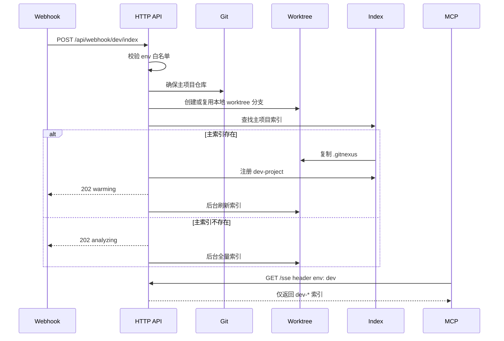

# Webhook Worktree 环境索引方案

## 背景

当前 GitNexus 已支持通过 `gitnexus analyze --name <alias>` 将同一类项目注册为不同索引名，也已在 MCP SSE 通道中通过 `projects` HTTP Header 做会话级项目白名单过滤。本方案在这些既有能力上增加 webhook 驱动的环境索引创建能力。

目标是让外部系统通过 webhook 传入环境变量值（例如 `dev`、`saas`），GitNexus 校验该值是否被环境变量允许，然后用 worktree 创建本地分支，把该分支快速注册为 `${env}-${projectName}` 索引。为了减少索引耗时，优先复制主项目已有 `.gitnexus` 索引，使 MCP 先快速可用，再由后台任务做增量刷新。

## 已确认约束

- `worktree` 用于创建和承载本地分支，不要求远程分支存在。
- “head” 指 HTTP Header，不是 git `HEAD`。
- webhook 响应可以快速返回，后台继续增量刷新索引。
- 当主项目已有索引时，优先复制主索引作为快速可用基线。
- 当主项目或主索引不存在时，允许走首次初始化或全量索引兜底。
- 不改变无 Header MCP 请求的既有行为。
- 不改变现有 `/api/analyze` 的语义。

## API 设计

新增 webhook 路由：

```text
POST /api/webhook/:env/index
```

`:env` 必须命中服务端白名单：

```text
GITNEXUS_WEBHOOK_ALLOWED_ENVS=dev,saas
```

建议请求体：

```json
{
  "repoUrl": "https://example.com/org/project.git",
  "projectName": "project",
  "branch": "feature-local-branch",
  "baseRef": "main",
  "forceRefresh": false
}
```

字段语义：

| 字段 | 必填 | 说明 |
| --- | --- | --- |
| `repoUrl` | 条件必填 | 主项目不存在时用于 clone；如果服务端能通过项目映射找到本地主项目，可省略 |
| `projectName` | 是 | 用于生成 worktree 项目名和 registry name |
| `branch` | 是 | worktree 本地分支名 |
| `baseRef` | 否 | 本地分支不存在时的基准引用，默认 `main` 或项目默认分支 |
| `forceRefresh` | 否 | 是否强制后台刷新 |

快速成功响应：

```json
{
  "status": "warming",
  "repo": "dev-project",
  "worktreePath": "C:\\Users\\...\\.gitnexus\\worktrees\\dev-project",
  "refreshJobId": "..."
}
```

首次无主索引兜底响应：

```json
{
  "status": "analyzing",
  "repo": "dev-project",
  "worktreePath": "C:\\Users\\...\\.gitnexus\\worktrees\\dev-project",
  "refreshJobId": "..."
}
```

错误响应要区分：

- `400`：参数缺失、非法环境值、非法项目名、非法分支名。
- `403`：`:env` 不在白名单。
- `409`：同一 worktree 或同一 repo 正在刷新。
- `500`：clone、worktree、索引复制或后台任务启动失败。

## MCP Header 设计

保留现有 `projects` Header 精确过滤：

```http
projects: dev-project,dev-other
```

新增环境过滤 Header：

```http
env: dev
```

过滤规则：

- 仅传 `env: dev`：只暴露 registry name 以 `dev-` 开头的索引。
- 仅传 `projects`：保持现有精确白名单行为。
- 两者都传：取交集，避免越权。
- 都不传：保持当前默认行为，暴露已注册索引。
- `env` 必须命中 `GITNEXUS_WEBHOOK_ALLOWED_ENVS` 或独立 MCP 白名单，避免调用方随意枚举前缀。

## Worktree 与索引流程

主流程：

```text
1. 接收 POST /api/webhook/:env/index
2. 校验 env 是否在 GITNEXUS_WEBHOOK_ALLOWED_ENVS
3. 校验 projectName、branch、baseRef
4. 确保主项目本地仓库存在；不存在时按 repoUrl clone
5. 用 worktree 创建或复用本地分支
6. 生成 registryName = `${env}-${projectName}`
7. 如果主项目 `.gitnexus/lbug` 存在：
   7.1 复制主项目 `.gitnexus` 到 worktree
   7.2 更新 worktree meta 中的 repoPath、branch、lastCommit、indexedAt
   7.3 注册 registryName
   7.4 webhook 返回 `warming`
   7.5 后台执行增量刷新
8. 如果主项目索引不存在：
   8.1 webhook 返回 `analyzing`
   8.2 后台执行首次全量 analyze
9. 后台任务结束后刷新 MCP backend repo cache
```

本地分支创建策略：

```text
git worktree add -b <branch> <worktreePath> <baseRef>
```

如果本地分支已存在：

```text
git worktree add <worktreePath> <branch>
```

如果 worktree 已存在，则校验它指向同一主仓库和目标分支；匹配则复用，不匹配则返回 `409`，避免覆盖用户目录。

## 主索引复制策略

复制范围：

- 复制主项目 `.gitnexus` 目录到 worktree 的 `.gitnexus`。
- 不复制 `.git` 内容。
- 不写入主项目索引。

复制后必须更新：

- `meta.repoPath`：worktree 绝对路径。
- `meta.branch`：worktree 当前本地分支。
- `meta.lastCommit`：worktree 当前 commit。
- `meta.indexedAt`：复制完成时间。
- registry entry 的 `name`：`${env}-${projectName}`。
- registry entry 的 `path`：worktree 绝对路径。

快速可用期的语义：

- MCP 可立即查询到 `env-projectName`。
- 查询结果在后台刷新完成前可能仍接近主分支快照。
- 需要在 list/repo/status 或 webhook 响应中暴露 `warming` 状态，避免使用方误以为已经精准同步。

后台刷新策略：

- 默认后台触发 analyze。
- 若当前 GitNexus 已有增量能力，则用增量刷新。
- 若没有可复用增量能力，先用现有 `runFullAnalysis` 作为后台兜底，后续再优化为真正增量。
- 刷新时传入 `registryName = ${env}-${projectName}`，避免覆盖主项目注册名。

## 兼容性影响

不会改变：

- `/api/analyze` 请求和响应。
- 无 Header 的 MCP 默认行为。
- 现有 `projects` Header 精确过滤行为。
- 主项目原有 registry name。

新增行为只在以下条件触发：

- 调用新增 webhook 路由。
- MCP SSE 请求携带 `env` Header。

主要风险：

- 快速复制索引后的短暂陈旧数据风险。
- worktree 目录复用时的路径冲突风险。
- registry name 冲突风险。
- 主索引复制过程中如果有 analyze 写入，可能遇到 LadybugDB 文件锁或半拷贝风险。

缓解方式：

- 复制前获取与 analyze 相同粒度的 repo lock。
- registryName 冲突时返回 `409`，除非明确允许覆盖同一路径。
- worktreePath 固定落在 GitNexus 管理目录下，不接受任意外部路径。
- webhook 响应明确 `warming` / `analyzing`。

## 测试设计

单元测试：

- `env` 白名单解析和校验。
- `registryName = env-projectName` 生成规则。
- 非法 `env`、`projectName`、`branch` 拒绝。
- MCP `env` Header 转换为前缀过滤。
- `projects` 与 `env` 同时存在时取交集。

集成测试：

- 主索引存在时，webhook 返回 `warming`，并注册 `${env}-${projectName}`。
- 主索引不存在时，webhook 返回 `analyzing`，后台执行全量 analyze。
- worktree 本地分支不存在时自动创建。
- worktree 已存在且匹配时复用。
- worktree 已存在但不匹配时返回 `409`。
- MCP SSE 携带 `env: dev` 时，只返回 `dev-` 前缀索引。

## 主流程时序图



## 后续实施边界

第一阶段只做最小闭环：

- 新增 webhook 路由。
- 新增 worktree 创建/复用服务。
- 新增主索引复制服务。
- 新增 `env` Header 过滤。
- 后台刷新先复用现有 analyze job 能力。

暂不做：

- 真正细粒度增量索引算法。
- UI 配置页面。
- registry schema 大迁移。
- 远程分支管理。
